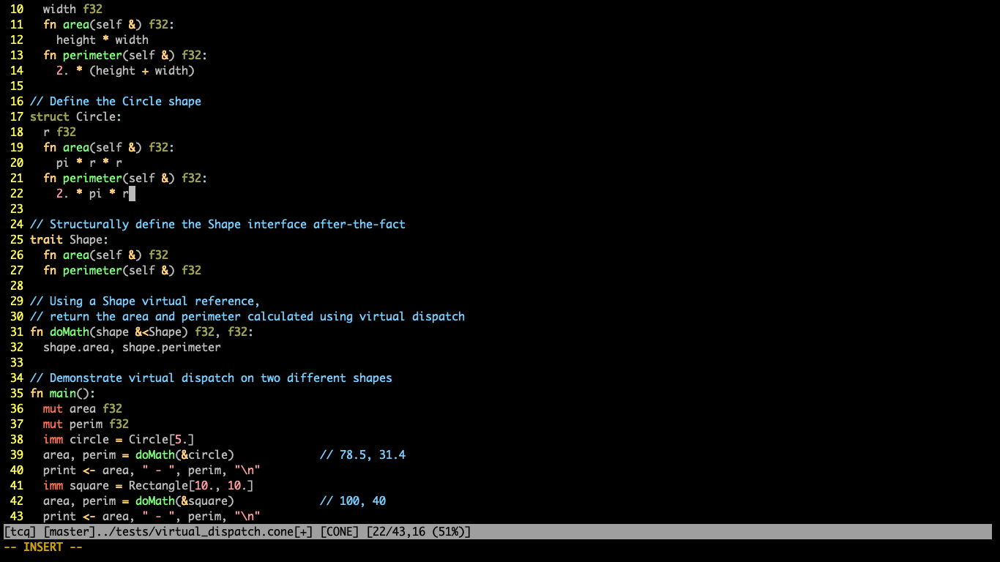

# Cone.vim
Syntax highlighting for [Jonathan Goodwin's](https://jondgoodwin.com/) programming language, [Cone](https://cone.jondgoodwin.com/).
Derived from [tetralux' odin.vim](https://github.com/Tetralux/odin.vim)

### What it looks like. (in Iterm on Mac with Vim's colorscheme desert256)

### A tip to refresh the syntax highlightig
Remember that sometimes, like when pasting many lines of code in between block comment marked by `/*` and `*/`, the highlighting
might need a little refreshing : in that case use vim's `:redraw` which shortcut is `Ctrl-L`.

### Installation

Simply clone the repository into your Vim's package directory. (Vim must be installed from https://www.vim.org.)
If using [Pathogen](https://github.com/tpope/vim-pathogen), clone it instead into the `bundle` folder within Vim's package directory.

Note that the package directory is located in `%USERPROFILE%\vimfiles` on Windows,
and `~/.vim` on Unix/Mac.

### Options

Some options are available in the file `cone.vim/syntax/cone.vim`, search for the word "OPTIONS" : just comment-out as needed.
